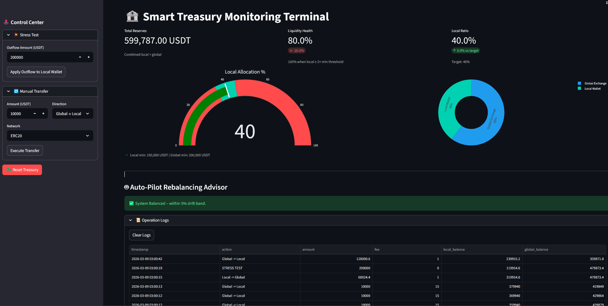

# Treasury Monitoring Terminal: Smart Rebalancing Manual
Treasury monitoring terminal simulation app to demonstrate the treasury rebalancing process in a crypto exchange. A simplified example.

## 1. Project Background & Business Case
In the ecosystem of a crypto exchange, "Inventory Management" is a critical pillar of Business Operations. Capital is generally split between two venues:
* **Local Hot Wallets:** Used for immediate user withdrawals. High availability is required.
* **Global Liquidity Pools:** Used as a "backstop" for bulk inventory.

### The Challenge: The "Liquidity Gap"
If a major market event triggers a "Bank Run" (mass withdrawals), the Local Wallet can be depleted in minutes. Conversely, keeping too much capital locally increases security risks and incurs opportunity costs. 

### The Solution: "Smart Rebalancing"
This terminal acts as a decision-support system that monitors these levels in real-time. It uses a **Drift-Band Strategy** to ensure the exchange stays solvent while minimizing transaction friction and network fees.

  

---

## 2. Operational Instruction Manual

### Section A: Monitoring the KPI Dashboard
Upon launching the terminal, observe the top metrics:
* **Liquidity Health:** This is your primary "Danger" gauge. It measures local USDT against its **Minimum Safety Threshold**. 
    * *100% Health:* Local balance is $\ge$ double the minimum threshold.
    * *Red Zone:* If health drops below 50%, a liquidity crunch is imminent.
* **Local Ratio Gauge:** Visualizes the current percentage of assets held locally vs. the **40% Target Ratio**.

### Section B: Using the Auto-Pilot Advisor
The **🤖 Auto-Pilot Rebalancing Advisor** is designed for "Management by Exception." 
1.  **Drift Detection:** The system allows for a **5% Drift Band**. It will not bother the operator for small fluctuations.
2.  **Action Trigger:** If the ratio drifts beyond 5% (e.g., local falls to 34% or rises to 46%), a warning appears.
3.  **Execution:** Clicking the **"Execute Recommended Move"** button restores target parity instantly using the most cost-effective network (e.g., TRC20).

### Section C: Executing Stress Tests
To prepare for "Black Swan" events, use the **💥 Stress Test** module in the sidebar:
1.  Enter a hypothetical **Outflow Amount** (e.g., 250,000 USDT).
2.  Click **Apply Outflow**. 
3.  Observe how the system's Health Score reacts and how the Auto-Pilot adjusts its rebalancing recommendation to save the local liquidity pool.

### Section D: Auditing & Logs
Every internal movement is captured in the **📜 Operation Logs**. This table provides a high-fidelity audit trail, including:
* **Timestamp** of the event.
* **Action Type** (Manual, Auto-Pilot, or Stress Test).
* **Network Fee** paid.
* **Snapshot** of balances in both venues after the move.

---

## 3. Technical Implementation & Logic

### Rebalancing Formulas
The system calculates rebalancing needs based on the distance from the **Target Parity**:

$$Target\ Amount = Total\ Reserves \times 0.40$$

The **Drift Condition** is evaluated as:

$$\text{If } \lvert Target - Local\ \rvert > (Total \times 0.05) \rightarrow \text{Trigger Alert}$$

### Tech Stack
* **Frontend:** Streamlit for real-time interactivity.
* **State Management:** `st.session_state` used to simulate a persistent ledger for balances and logs.
* **Data Processing:** Pandas for structured log auditing.
* **Visualization:** Plotly for professional-grade "Command & Control" indicators.

---

## 4. How to Run
1. Clone this repository.
2. Install requirements: `pip install streamlit pandas plotly`.
3. Run the application: `streamlit run treasury_app.py`.
